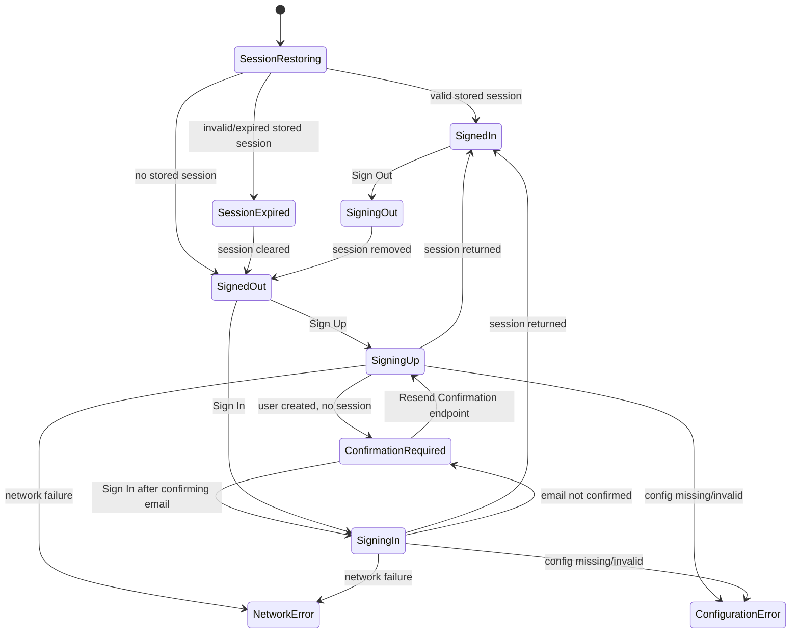
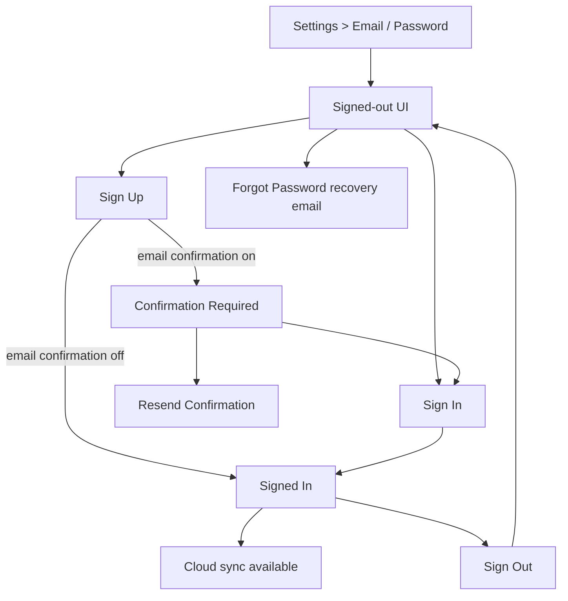

# CollectIQ Authentication Specification

Audit date: 2026-07-02

This document is the single source of truth for CollectIQ email authentication in SIT and future Production. It does not enable Production, Google, Apple, or any new Supabase schema.

## Auth States

Supported states:

- Signed Out
- Signing Up
- Confirmation Required
- Signing In
- Signed In
- Session Restoring
- Session Expired
- Signing Out
- Network Error
- Configuration Error



## Screen Flow



Signed-out UI shows email field, password field, **Sign Up**, **Sign In**, and **Forgot Password**. **Sign Out** is visible only for an authenticated email session. **Resend Confirmation** is visible only while awaiting email confirmation and a pending confirmation email is known.

## Session Lifecycle

One active Supabase user session is allowed on the device.

1. App starts in Session Restoring.
2. If no stored session exists, the state becomes Signed Out.
3. If a stored session exists, it is validated against Supabase before use.
4. A valid session becomes Signed In and enables cloud sync.
5. An expired or invalid session is cleared and reports `Session expired. Please sign in again.`
6. Sign Out calls Supabase sign-out, removes the local auth session, disables cloud sync, and preserves the local portfolio.

## User Lifecycle

1. A new user signs up with email and password.
2. If email confirmation is enabled, Supabase creates the account and sends a confirmation email, but no authenticated session exists yet.
3. The app remains signed out and shows the confirmation-required message.
4. After confirming email, the user signs in.
5. If email confirmation is disabled, sign-up may return an authenticated session immediately.
6. A different user can sign in after Sign Out. Cloud sync must use the new user id. Local unsynced items remain local and must not be deleted because the auth user changed.

## Cloud Sync Relationship

Cloud sync is enabled only when all are true:

- User is signed in with a non-anonymous email session.
- Supabase is configured.
- Cloud portfolio sync is enabled for SIT/dev.
- Cloud image storage is enabled for SIT/dev.

Cloud sync is never run for signed-out users. Anonymous/dev sessions must not masquerade as signed-in email users.

## UI Messages

| Condition | Message |
| --- | --- |
| Sign-up confirmation required | `Check your email to confirm your account, then sign in.` |
| Empty/string successful sign-up response | `Check your email to confirm your account, then sign in.` |
| Confirmation resent / repeated unconfirmed sign-up | `Your account already exists but hasn't been confirmed. We've sent (or re-sent) the confirmation email. Please confirm your email then sign in.` |
| Confirmation resend success | `Confirmation email sent. Please check Inbox, Spam, Junk, and Promotions.` |
| Confirmation resend rate-limited | `Too many confirmation requests. Please wait before trying again.` |
| Confirmation resend cooldown | `Resend available in 59s` |
| Confirmation resend max attempts | `Too many confirmation emails requested. Please check your inbox or try again later.` |
| Confirmation resend for confirmed email | `Your email is already confirmed. Please sign in.` |
| Existing confirmed account during sign-up | `An account already exists. Please sign in.` |
| Empty email | `Enter an email address.` |
| Invalid email | `Please enter a valid email address.` |
| Empty password | `Enter a password.` |
| Weak local password | `Password must be at least 6 characters.` |
| Weak Supabase password | `Password is too weak. Use a stronger password.` |
| Sign-in before confirmation | `Please confirm your email before signing in.` |
| Wrong password | `Invalid email or password.` |
| Unknown account | `Please sign up first.` when Supabase proves no account exists; otherwise `Invalid email or password.` |
| Network unavailable | `Unable to reach Supabase. Check your internet connection.` |
| Configuration missing/invalid | `Supabase configuration is missing or invalid.` |
| Missing anon key response | `Supabase anon key is missing from SIT config.` |
| Rate limited | `Too many auth requests. Wait a moment and try again.` |
| Expired session | `Session expired. Please sign in again.` |
| Forgot password | `Password reset email sent. Please wait before requesting another.` |
| Password reset rate-limited | `Too many reset requests. Please wait a few minutes and try again.` |
| Deep link confirmation success | `Email confirmed successfully.` |
| Deep link confirmation success without session | `Email confirmed. Please sign in.` |
| Invalid or expired confirmation link | `This confirmation link is invalid or expired. Please request a new confirmation email.` |
| Unknown confirmation callback error | `Could not complete email confirmation. Please try again.` |

Generic connection wording is allowed only for true network failures such as timeout, DNS failure, socket failure, or no internet.

## Required Scenarios

| # | Scenario | Expected behaviour |
| --- | --- | --- |
| 1 | Fresh app install | No user. Show Sign Up and Sign In. Hide Sign Out. Cloud sync disabled. |
| 2 | Sign Up, confirmation on | Create account, send confirmation email, remain signed out, show confirmation-required message. Supabase may return `{ user, session: null }`, a direct user object with `id`/`email`/`aud`/`role`, `confirmation_sent_at`, `identities`, or an empty 2xx body; all are treated as successful confirmation-required sign-up. |
| 3 | Sign Up, confirmation off | Session returned; immediately signed in. |
| 4 | Empty email | Validation error; do not call Supabase. |
| 5 | Invalid email | Validation error; do not call Supabase. |
| 6 | Weak password | Local length validation error when detectable; otherwise mapped Supabase weak-password message. |
| 7 | Repeated Sign Up before confirmation | Do not show network or unknown error. Show confirmation resent message when user explicitly resends. |
| 8 | Repeated Sign Up after account confirmed | Show existing-account message and offer Sign In. Forgot Password sends a Supabase password recovery email. |
| 9 | Successful Sign In | Session created, sync enabled, Sign Out visible. |
| 10 | Wrong password | Invalid credentials message; stay signed out. |
| 11 | Email not confirmed | Show `Please confirm your email before signing in.`; stay signed out. |
| 12 | Email not registered | Show `Please sign up first.` if Supabase proves the account is missing, otherwise invalid credentials. |
| 13 | Network unavailable | Show network message only for true network failures. |
| 14 | Supabase config missing | Show configuration invalid message. |
| 15 | Session restored | Automatically signed in after stored session validates. |
| 16 | Session expired | Clear session, show session expired message, preserve local data. |
| 17 | Sign Out | Remove auth session, disable cloud sync, preserve local portfolio. |
| 18 | Different user signs in | Use the new user id for cloud sync. Do not mix cloud data. Preserve local unsynced items. |
| 19 | Resend confirmation email | Show Resend Confirmation only while confirmation is pending. Call Supabase `/auth/v1/resend` with `type: signup`; on success show `Confirmation email sent. Please check Inbox, Spam, Junk, and Promotions.`, disable resend for 60 seconds, and show countdown text. |
| 20 | Forgot password | Call Supabase password recovery with `https://packlox.com/auth/reset-password` as the browser redirect URL and show `Password reset email sent. Please wait before requesting another.` on success. Disable repeat requests for 60 seconds. The mobile app must ignore `type=recovery` callbacks. |
| 21 | User taps Supabase email confirmation link | Android opens CollectIQ SIT through `collectiq-sit://auth/callback`; the app parses the callback without logging tokens, completes the Supabase session when tokens are present, and shows the appropriate confirmation result message. |

## Resend Confirmation Cooldown

Resend confirmation is session-local and intended to prevent accidental Supabase rate limits.

- Normal successful resend starts a 60 second cooldown.
- Supabase rate-limit response starts a cooldown from the `Retry-After` response header when present.
- Supabase rate-limit response without `Retry-After` starts a 5 minute fallback cooldown.
- A rate-limit response does not mean Supabase sent another confirmation email.
- The app allows at most 3 resend attempts per 15 minutes per app session.
- While cooldown is active, the resend button is disabled and displays `Resend available in {seconds}s`.
- If the session maximum is reached, show `Too many confirmation emails requested. Please check your inbox or try again later.`
- Sign In remains visible during confirmation-required state.
- Sign Out remains hidden until a real authenticated email session exists.
- Cooldowns do not enable production services and do not change Supabase schema.
- SIT diagnostics may show last resend status (`sent`, `rate-limited`, or `failed`), cooldown source (`success`, `retry-after`, `fallback`, or `app-limit`), cooldown remaining, and masked pending confirmation email.

## Email Confirmation Deep Links

SIT mobile confirmation uses:

```text
collectiq-sit://auth/callback
```

Future production confirmation is reserved as:

```text
collectiq://auth/callback
```

Production auth remains disabled until a later production release hardening sprint.

Packlox web auth support uses these browser routes:

```text
https://packlox.com/auth/callback
https://packlox.com/auth/reset-password
```

`/auth/callback` handles email confirmation gracefully in a browser. `/auth/reset-password` accepts Supabase recovery tokens from the URL, lets the user enter and confirm a new password, calls Supabase `updateUser({ password })`, and shows `Password updated successfully.` followed by `Return to the Packlox app and sign in with your new password.` on success.

Password recovery must never use `collectiq-sit://auth/callback`. The app requests `https://packlox.com/auth/reset-password` through the Supabase recover call and shows that requested redirect in SIT diagnostics. Supabase does not return the generated email link to the mobile client, so the exact clicked link must be inspected in the received email or Supabase email template/logs. If a password reset email opens the mobile app, the email was generated with the wrong redirect URL, usually because the recovery request or Supabase Auth URL configuration fell back to the mobile Site URL or an older email template/link was used.

The static web pages read Supabase config from `web/auth/config.js` at deploy time. Do not commit real Supabase URLs, anon keys, service-role keys, access tokens, refresh tokens, or passwords.

The callback parser supports Supabase parameters in either the query string or URL fragment:

- `access_token`
- `refresh_token`
- `type`
- `token_hash`
- `error`
- `error_description`

Callback handling:

- `access_token` plus `refresh_token`: validate `/auth/v1/user`, save the Supabase session through the existing local session store, show `Email confirmed successfully.`, and show the signed-in user.
- `type=signup`, `type=email`, `type=magiclink`, or `token_hash` without session tokens: show `Email confirmed. Please sign in.`
- `type=recovery`: ignore in the mobile app. Recovery belongs on `https://packlox.com/auth/reset-password`.
- `error` or `error_description` containing invalid/expired/token wording: show `This confirmation link is invalid or expired. Please request a new confirmation email.`
- Other callback errors: show `Could not complete email confirmation. Please try again.`
- Local mode ignores SIT callbacks safely.
- Production mode ignores callbacks until production auth is explicitly enabled.

## Diagnostics Rules

SIT/debug auth diagnostics may log:

- endpoint
- HTTP status
- content type
- response body type
- Supabase error code/message
- response keys only
- user present yes/no
- session present yes/no
- direct id/email present yes/no
- confirmation timestamp present yes/no
- normalized auth result

Diagnostics must never log:

- password
- access token
- refresh token
- anon key
- full auth response body

Settings > SIT Readiness also shows the last auth attempt metadata in SIT:
action, HTTP status, normalized result, response body type, response keys only,
and timestamp. This panel exists to verify real Supabase response shapes without
showing secrets.

## Implementation Notes

The active implementation lives in:

- `lib/core/supabase/supabase_auth_response_normalizer.dart`
- `lib/core/supabase/supabase_service.dart`
- `lib/features/auth/data/repositories/supabase_auth_repository.dart`
- `lib/features/auth/presentation/controllers/auth_controller.dart`
- `lib/features/settings/presentation/settings_screen.dart`

Local mode remains available without Supabase config. Production Supabase
requires explicit cloud flags and public Supabase configuration.
