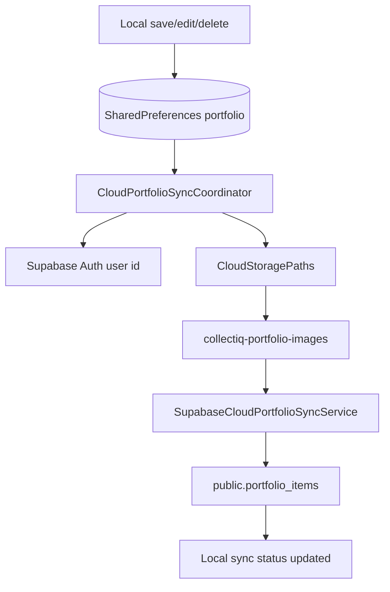

# CollectIQ Supabase Architecture

Audit date: 2026-07-01

## Decision

CollectIQ uses one Supabase architecture for SIT cloud sync:

- Schema table: `public.portfolio_items`
- Profile table: `public.user_profiles`
- Storage bucket: `collectiq-portfolio-images`
- Image object path: `users/{userId}/portfolio_images/{itemId}.jpg`
- Flutter sync service: `SupabaseCloudPortfolioSyncService`
- Flutter storage service: `SupabaseCloudStorageService`
- Sync coordinator: `CloudPortfolioSyncCoordinator`
- Storage path helper: `CloudStoragePaths`
- Mapper: `supabaseRowForItem` / `itemFromSupabaseRow`

The previous duplicate Supabase path has been removed. Current code, migrations, setup checks, and tests now target the same schema and bucket.

## Why This Schema

`portfolio_items` is the closest match to the Flutter `CollectibleItem` domain model. It keeps local-first fields such as title, category, manufacturer, series, year, country, pricing range, local image path, cloud image metadata, sync status, and raw JSON together in one row. This avoids translation through an older generic cloud shape and makes save, edit, delete, fetch, and merge behavior easier to reason about.

The storage bucket name `collectiq-portfolio-images` is explicit to the app and portfolio image use case. Object paths are scoped under the authenticated Supabase user id so RLS/storage policies can enforce ownership.

## Tables

### `public.user_profiles`

Stores a minimal profile for authenticated Supabase users.

Important columns:

- `id uuid primary key references auth.users(id)`
- `email text`
- `display_name text`
- `created_at timestamptz`
- `updated_at timestamptz`

Rows are created by `public.handle_new_auth_user()` when Supabase Auth creates a user.

### `public.portfolio_items`

Stores cloud-backed copies of local portfolio items.

Important columns:

- `id text`
- `user_id uuid references auth.users(id)`
- `category text`
- `title text`
- `manufacturer text`
- `series text`
- `year integer`
- `country text`
- `estimated_value_low numeric(12, 2)`
- `estimated_value_high numeric(12, 2)`
- `image_local_path text`
- `image_storage_path text`
- `cloud_image_url text`
- `sync_status text`
- `last_synced_at timestamptz`
- `raw_json jsonb`
- `created_at timestamptz`
- `updated_at timestamptz`

Primary key:

- `(id, user_id)`

Allowed sync statuses:

- `localOnly`
- `pendingUpload`
- `synced`
- `failed`
- `deleted`

## Storage

Bucket:

- `collectiq-portfolio-images`

Object path:

- `users/{userId}/portfolio_images/{itemId}.jpg`

The bucket is private. The Flutter storage service uploads with authenticated Supabase REST calls, requests signed URLs when possible, and falls back to a public URL builder only as a non-authoritative convenience path.

## RLS Policies

`user_profiles` policies allow users to read, insert, and update only their own profile row.

`portfolio_items` policies allow users to read, insert, update, and delete only rows where `auth.uid() = user_id`.

Storage policies allow users to read, upload, update, and delete objects only in:

```text
users/{auth.uid()}/portfolio_images/*
```

## Sync Flow



Rules:

- Local save happens first.
- Cloud upload starts only after local data exists.
- Failed cloud work keeps the item local.
- Image upload failure marks the item retryable/failed locally.
- Portfolio sync uses upsert-style writes into `portfolio_items`.
- Delete writes a cloud tombstone status of `deleted`.
- Fetch returns only non-deleted rows for the signed-in user.

## Migration Report

Old architecture removed:

- Generic cloud portfolio table path
- Generic cloud image bucket path
- Duplicate old Supabase portfolio repository
- Duplicate old Supabase image storage repository
- Duplicate old local-first cloud sync service
- Duplicate old Supabase schema/id helpers

New architecture retained:

- `public.portfolio_items`
- `public.user_profiles`
- `collectiq-portfolio-images`
- `users/{userId}/portfolio_images/{itemId}.jpg`
- `CloudServiceRegistry`
- `CloudPortfolioSyncCoordinator`
- `SupabaseCloudPortfolioSyncService`
- `SupabaseCloudStorageService`
- `CloudStoragePaths`

Files deleted:

- `lib/features/cloud_sync/data/repositories/supabase_cloud_portfolio_repository.dart`
- `lib/features/cloud_sync/data/repositories/mock_cloud_portfolio_repository.dart`
- `lib/features/cloud_sync/data/services/local_first_sync_service.dart`
- `lib/features/cloud_sync/domain/repositories/cloud_portfolio_repository.dart`
- `lib/features/image_storage/data/repositories/supabase_image_storage_repository.dart`
- `lib/core/supabase/supabase_schema.dart`
- `lib/core/supabase/supabase_ids.dart`
- old Supabase migration files replaced by `202607010001_collectiq_portfolio_items_schema.sql`

Files updated:

- `lib/features/cloud_sync/presentation/controllers/sync_controller.dart`
- `lib/features/image_sync/domain/services/upload_worker.dart`
- `lib/features/image_sync/presentation/controllers/image_sync_controller.dart`
- `lib/features/image_storage/image_storage_providers.dart`
- `supabase/setup/production_readiness_checks.sql`
- `scripts/validate_supabase_setup.py`
- Supabase-related tests

Schema used:

- `public.user_profiles`
- `public.portfolio_items`

Storage bucket used:

- `collectiq-portfolio-images`
